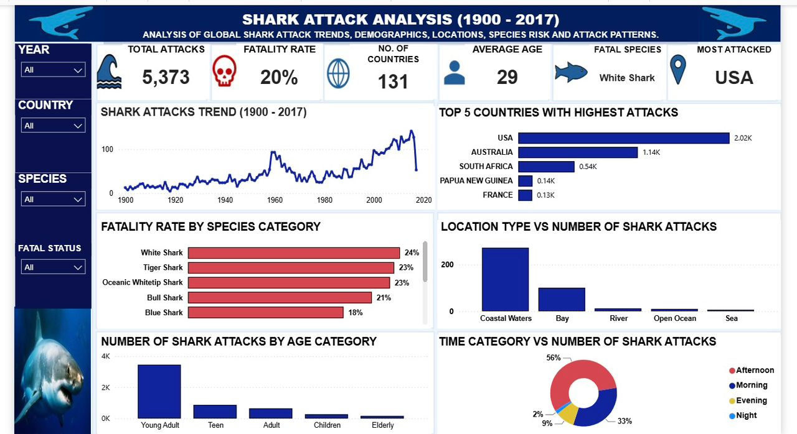

# \# 🦈 Global Shark Attack Analysis

# 

---

# Project Overview

## This project explores global shark attack records to identify attack trends, affected age groups, high risk countries, and shark species responsible for attacks.

---

# 

# \# Business Problem

# 

# Understanding historical shark attack patterns can support public awareness, improve beach safety measures, and identify locations with higher attack risks.

# 

# \---

# 

# \# Tools Used

# 

# \- Microsoft Power BI

# \- Power Query

# \- DAX

# \- Microsoft Excel

# 

# \---

# 

# \# Dataset

# 

# Historical global shark attack records containing information on victims, countries, shark species, injuries, activities, and attack outcomes.

# 

# \---

# 

# \# Data Cleaning

# 

# \- Removed duplicates

# \- Handled missing values

# \- Standardized text fields

# \- Created age groups

# \- Created species categories

# \- Corrected data types

# 

# \---

# 

# \# Data Model

# 

# Star Schema

# 

# \- Fact Shark Attack

# \- DIM Victim

# \- DIM Injury

# 

# \---

# 

# \# Dashboard KPIs

# 

# \- Total Shark Attacks

# \- Fatality Rate

# \- Average Victim Age

# \- Countries Represented

# 

# \---

# 

# \# Dashboard Preview

# 

# \## Dashboard

# 

# !\[Dashboard](Images/dashboard.png)

# 

# \## Data Model

# 

# !\[Data Model](Images/model.png)

# 

# \---

# 

# \# Key Insights

# 

# \- Australia, the United States, and South Africa recorded the highest number of attacks.

# \- Most attacks were non fatal.

# \- Adults experienced the highest number of attacks.

# \- Great White Sharks appeared most frequently in recorded incidents.

# 

# \---

# 

# \# Repository Structure

# 

# ```

# Global-Shark-Attack-Analysis

# │

# ├── Dashboard

# ├── Data

# ├── DAX

# ├── Images

# ├── Report

# └── README.md

# ```

# 

# \---

# 

# \# Author

# 

# \*\*Amanda Jubin-Fofie\*\*

# 

# Clinical Dietitian transitioning into Health Data Analytics

# 

# \*\*Skills\*\*

# 

# \- Power BI

# \- SQL

# \- Excel

# \- Python (Learning)

# 

# GitHub: https://github.com/Jubin-A

