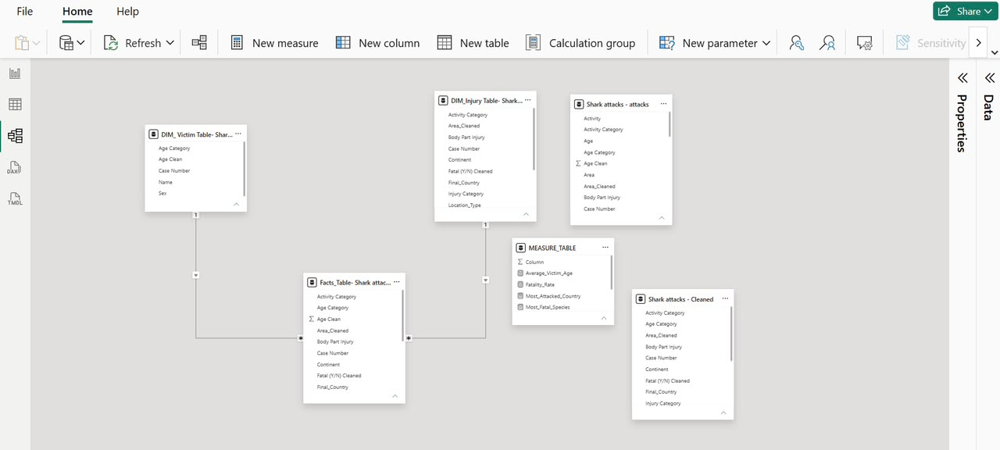

# 🦈 Global Shark Attack Analysis

 

---

## Project Overview

#### This project explores global shark attack records from 1900 t0 2017, to identify attack trends, affected age groups, high risk countries, and shark species responsible for attacks.

---

## Problem

#### Understanding historical shark attack patterns can support public awareness, improve beach safety measures, and identify locations with higher attack risks.

---

## Objectives

- Analyze global shark attack trends over time.
- Identify countries with the highest number of shark attacks.
- Examine shark attacks by age group.
- Analyze fatal and non fatal shark attacks.
- Identify the most common shark species involved.
- Explore attack patterns by location type.
- Analyze attacks by time of day.
- Develop an interactive Power BI dashboard for data exploration.

## Tools Used

- Microsoft Power BI
- Power Query
- DAX
- Microsoft Excel

---

## Dataset

#### Historical global shark attack records containing information on victims, countries, shark species, injuries, activities, and attack outcomes.

---

## Data Cleaning

- Removed duplicates

- Handled missing values

- Standardized text fields

- Created age groups

- Created species categories

- Corrected data types

---

## Data Model

A star schema was created to improve performance and simplify analysis.



---

## Dashboard

The interactive Power BI dashboard provides insights into global shark attack trends, victim demographics, shark species, fatality patterns, and geographic distribution to support data driven decision making and public safety awareness.

## Dashboard KPIs

- Total Shark Attacks
- Fatality Rate
- Average Victim Age
- Countries Represented
- Most Fatal Species
- Most Attacked Country

 

---

## Key Insights

- The United States, Australia and South Africa recorded the highest number of attacks.
- Most attacks were non fatal.
- Adults experienced the highest number of attacks.
- Great White Sharks appeared most frequently in recorded incidents.

---

## Recommendations

- Increase public safety awareness in high risk coastal areas.
- Promote safe swimming and surfing practices, particularly during afternoon hours.
- Strengthen shark monitoring and warning systems in high incident regions.
- Develop targeted safety campaigns for high risk age groups.
- Support emergency response training for common shark attack injuries.
- Maintain standardized data collection to improve future monitoring and analysis.

---

## Repository Structure

```
Global-Shark-Attacks-Analysis/
│
├── Dashboard/
│   └── Amanda Jubin-Fofie_Shark Attacks.pbix
│
├── Data/
│   └── Data/Shark attacks - attacks.csv
│
├── Images/
│   ├── 
│   ├── 
│
├── Report/
│   └── Report/Amanda-Jubin-Fofie_Shark-Attack-Analysis.pdf
│
└── README.md
```

## Author 

**Amanda Jubin-Fofie**

Registered Clinical Dietitian | Aspiring Healthcare Data Analyst

Power BI • SQL • Excel • Data Analytics

### GitHub: https://github.com/Jubin-A
